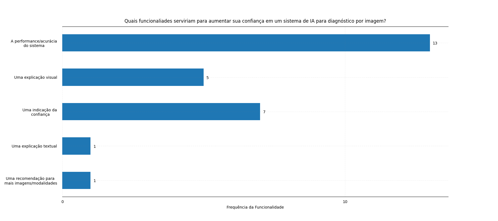

# Análise de dados para projeto de pesquisa PIBIC-PIBITI

## Sumário

- [Recursos utilizados](#recursos-utilizados)
- [Organização de diretórios](#organização-de-diretórios)
- [Exemplos de código](#exemplos-de-código)
- [Executando código](#executando-código)
- [Contribuidores](#contribuidores)

Este repositório é composto por _scripts_ Python focados em produzir dados estatísticos e gráficos relacionados ao projeto de pesquisa de título:

 - **PIBIC**: Plano de Trabalho para Concepção e Avaliação de uma Ferramenta de Inteligência Artificial para a Geração de Laudos de Citologia Oncótica.

 - **PIBITI**: Desenvolvimento de um Sistema de Geração Automática de Laudos Médicos por Reconhecimento de Voz e Processamento de Linguagem Natural.

 Tais dados compoõem os estudos realizados sobretudo durante a primeira etapa de realização do projeto, na qual foram colhidas repostas de médicos especialistas, residentes e técnicos de Radiologia do Hospital Universitário Alcides Carneiro (HUAC/UFCG).

## Recursos utilizados

Visando promover geração e análise eficientes das informações obtidas, várias bibliotecas de _Python_ foram utilizadas para promover melhor tratamento dos dados em questão, a saber:


| Biblioteca/Módulo | Modo de instalação | Tarefa desempenhada |
|----------|----------|----------|
| [pandas](https://pandas.pydata.org/) | Instalador _pip_   | Análise, tratamento e agrupamento de dados |
| [matplotlib](https://matplotlib.org/) |  Instalador _pip_   | Geração de gráficos personalizados mediante integração com _pandas_.   |
| [scipy](https://scipy.org/) |  Instalador _pip_   | Análise estatística mediante algoritmos de computação científica. |


Na definição de parâmetro menores, especialmente para geração de gráficos, a biblioteca `numpy` foi utilizada.

## Organização de diretórios

Do ponto de vista de estrutura de diretórios, a organização dos módulos e arquivos pode ser visualizada da seguinte forma:

```diff
.
└── Pibic-Pibiti-Huac-Data-Analysis
    ├── data
    │   ├── csv_files
    │   └── graphs
    ├── src
    │   ├── aux
    │   ├── plot
    │   ├── stats
    │   └── main.py
    ├── .gitignore
    ├── README.md
    └── requirements.txt
```

### Diretório `data`

Em primeiro plano, no diretório `csv_files`, estão localizados os arquivos _csv_ associados às respostas obtidas após aplicação do questionário entre os profissionais do HUAC.

Adicionalmente, o diretório `graphs` contém os gráficos gerados após obtenção, análise e tratamento dos dados.

### Diretório `src`

Os _scripts_ responsáveis pela geração dos gráficos, importação dos módulos e continuidade das métricas estatísticas estão localizados aqui.

Ademais, um arquivo `main.py` atua como inicializador da aplicação, invocando funções e módulos _python_.

### Arquivo `requirements.txt`

Durante a organização do conjunto de dependências utilizadas no processo de geração, tratamento e análise dos dados, foi utilizado um **ambiente virtual** python (popularmente conhecido como _venv_) para isolar o espaço do repositório para as dependências utilizadas.

Dessa forma, visando promover a portabilidade e manutenabilidade do código, optou-se por fixar as versões (e nomenclaturas) das dependências utilizadas em um arquivo adequado.

Nesse sentido, fixa-se dependências e versões utilizando o comando:

```bash
pip freeze > ./requirements.txt
```

E atualiza-se as mesmas a partir de:

```bash
pip install -r ./requirements.txt
```

## Exemplos de código

Como exposto, diversas bibliotecas foram utilizadas para modelagem estrutural dos _scripts_. Nesse sentido, serão apresentados alguns exemplos de uso das bibliotecas em questão, como forma de apresentar a metologia e os procedimentos utilizados.

### Integração entre _pandas_ e _matplotlib_

Como apresentado, é possível integrar as bibliotecas de análise de dados e plotagem de gráficos. 

O exemplo a seguir, disponível em `./src/plot/generate_graphs.py`, retrata a integração entre objetos _DataFrame_, fundamentais na biblioteca _pandas_ e as configurações de geraçãod e gráficos com _matplotlib_.

```python
def generate_graph_5(df: pd.DataFrame):
    target_field = 'funcionalidades' # definição do campo alvo do DataFrame
    title = "Quais funcionaliades serviriam para aumentar sua confiança em um sistema de IA para diagnóstico por imagem?" # definição do título do gráfico

    ans_poss = ("A performance/acurácia do sistema", "Uma explicação visual", "Uma indicação da confiança", "Uma explicação textual", "Uma recomendação para mais imagens/modalidades") # possibilidades de resposta
    ans_poss_labels = ("A performance/acurácia\ndo sistema", "Uma explicação visual", "Uma indicação da\n confiança", "Uma explicação textual", "Uma recomendação para \nmais imagens/modalidades") # labels (etiquetas) associadas às possibiliades de reposta, formatadas com quebras de linha (\n)

    ans_values = [int(df[target_field].str.contains(ap).sum()) for ap in ans_poss] # contabilizando repostas obtidas

    # --- configurações gerais do gráfico ---
    fig, ax = plt.subplots(figsize=(18, 8))

    ax.barh(ans_poss_labels, ans_values, height=0.5)

    ax.set_xticks(range(0, max(ans_values) + 5, 10))
    ax.set_yticks(range(len(ans_poss_labels)))

    ax.xaxis.set_tick_params(pad=5)
    ax.yaxis.set_tick_params(pad=10)

    ax.xaxis.set_ticks_position('none')
    ax.yaxis.set_ticks_position('none')

    ax.set_yticklabels(ans_poss_labels, ma='center')

    for s in ('left', 'right'):
        ax.spines[s].set_visible(False)

    ax.invert_yaxis()

    ax.set_xlabel('Frequência da Funcionalidade')

    ax.grid(visible=True, color='grey', linestyle='-.', linewidth=0.5, alpha=0.2)

    for i in ax.patches:
        plt.text(i.get_width()+0.1, i.get_y()+0.3, str(round((i.get_width()), 2)), fontsize=10, color='black', ma='center')

    ax.set_title(title, pad=10)

    # ---

    plt.savefig(PATH + "graph5.png") # salvando imagem

    plt.clf() # encerrando instância de plt para não afetar a geração de outros gráficos
```

O código acima é responsável pela geração do seguinte gráfico:



### Métricas estatísticas utilizand _scipy_

A biblioteca _scipy_, através do módulo **stats**, fornece uma série de funções que permitem calcular coeficientes estatísticos diversos. Um dos coeficientes utilizados neste repositório e **Coeficiente de Correlação de Spearman** (ou _Rho_ de Spearman), uma medida estatística que avalia a correlação entre duas variáveis.

Nesse sentido, no arquivo `./src/stats/generate_stats.py`, com a função `calculate_spearmanr`, é possível fornecer um _DataFrame_ e uma tupla contendo as duas colunas (variáveis) cuja correlação será avaliada. Esta função, por sua vez, retorna tanto o coeficiente de fato, quanto um valor _**p**_, que reflete basicamente a possibilidade de correlação ocasional.

O código é:

```python
def calculate_spearmanr(df: pd.DataFrame, fields: tuple) -> tuple[float, float]:
    """
    Calcula o coeficiente de correlação de Spearman em relação a duas colunas específícas.

    Nesta função, é realizado um mapeamento das possíveis repostas para valores numéricos, o que permite o cálculo efetivo do coeficiente.
    Além disso, são excluídos valores nulos, o que facilita o cálculo estatístico.

    Parâmetros:
        df (pd.DataFrame): DataFrame original, contendo os dados e o identificador geral.
        fields (tuple): Tupla contendo as duas colunas a serem analisadas.
    Retorno:
        tuple[float, float]: Tupla contendo o coeficiente de correlação e o valor de "p" (rho, p).
    """
    global ID_FIELD

    # Evitar Warning de Pandas
    strict_df = df[list(fields)].copy()
    # Excluir valores NaN
    strict_df = strict_df.dropna()

    mapping = dict()

    # Ordenando dados (alfabeticamente) no set para evitar inconsistências no mapeamento
    possible_answers = sorted(set(strict_df[fields[0]]))

    idx = 0

    for ans in possible_answers:
        mapping[ans] = idx
        idx += 1

    # mapeamento das respostas (strings) em números
    strict_df[fields[0]] = strict_df[fields[0]].map(mapping)
    strict_df[fields[1]] = strict_df[fields[1]].map(mapping)

    strict_df = strict_df.dropna()

    # Restaura a ordem dos índices
    strict_df = strict_df.reset_index(drop=True)

    sp, p = spearmanr(strict_df[fields[0]], strict_df[fields[1]])

    return (float(sp), float(p)) # retorno do coeficiente junto a um valor p
```

Existem ainda outras métricas e funções disponibilizadas pela biblioteca _scipy_.

## Executando código

Para gerar gráficos e análises estatíscas personalizadas, siga o passo a passo:

1) Clone este repositório.

```bash
git clone https://github.com/guinoronhaf/Pibic-Pibiti-Huac-Data-Analysis.git
```

2) Navegue até o diretório raiz.

```bash
cd ./Pibic-Pibiti-Huac-Data-Analysis
```

3) Crie um novo ambiente virtual e carregue-o.

```bash
python3 -m venv .venv
source .venv/bin/activate
```

4) Atualize as dependências necessárias.

```bash
pip install -r ./requirements.txt
```

5) Execute o arquivo principal.

```bash
pytho3 -m src.main
```

---

## Contribuidores

 - [Guilherme Fragoso](https://github.com/guinoronhaf)
 - [João Ventura](https://github.com/joaoneto9)

---

Repositório componente de projeto de pesquisa associado a Unidade Acadêmica de Sistemas e Computação da Universidade Federal de Campina Grande (UASC/UFCG). A orientação do projeto é do Professor Dr. [Tiago Massoni](https://github.com/tiagomassoni).
